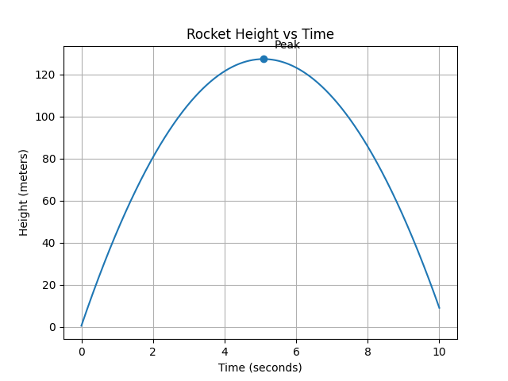

# Rocket Flight Simulation

This project simulates the vertical motion of a rocket using basic physics equations and Python.
The program calculates velocity and height over time and visualizes the results using a graph.

## Features:

Simulates rocket motion using kinematic equations

Calculates velocity and height

Plots height vs time graph

**Physics Used:**

v = v + a * dt
h = h + v * dt

**Where:**
v = velocity
h = height
a = acceleration due to gravity (-9.8 m/s²)
dt = time step

## How to Run?

Install Python

Install dependencies:

pip install -r requirements.txt

**Run simulation:**

python simulation.py

Example Output

The program generates a graph showing the rocket's height over time.

## Additional Features:
- Calculates maximum height reached
- Displays time at peak height
- Marks peak point on graph

## Results
The rocket reaches a maximum height of about 127 meters
at around 5 seconds.

## Simulation Output
